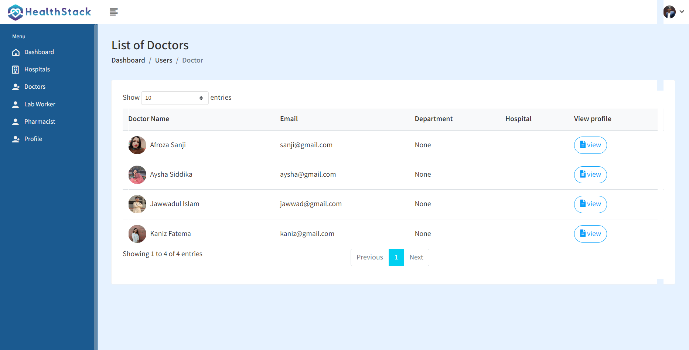
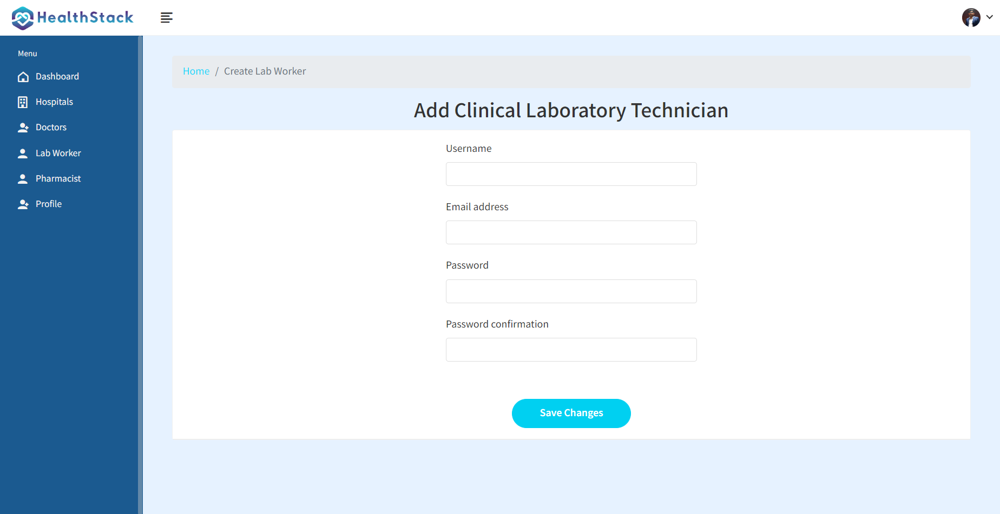
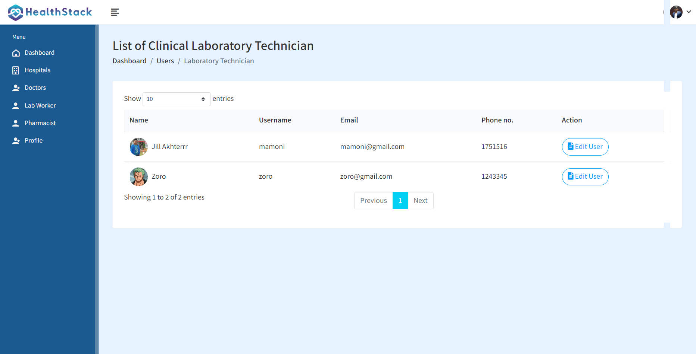
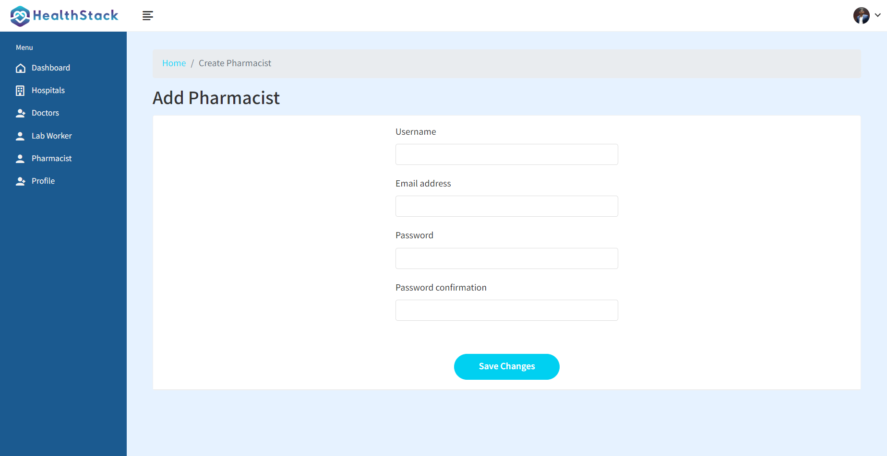
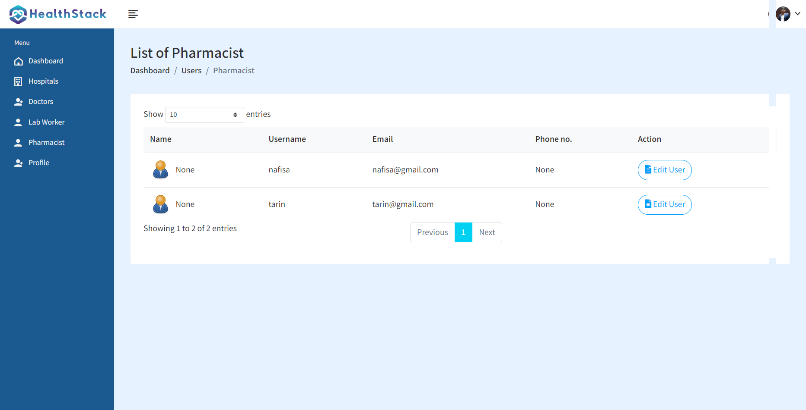
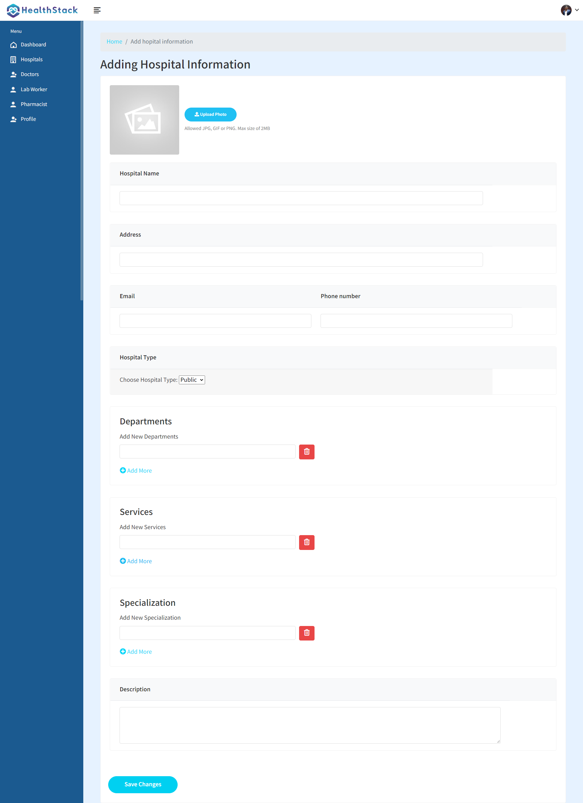
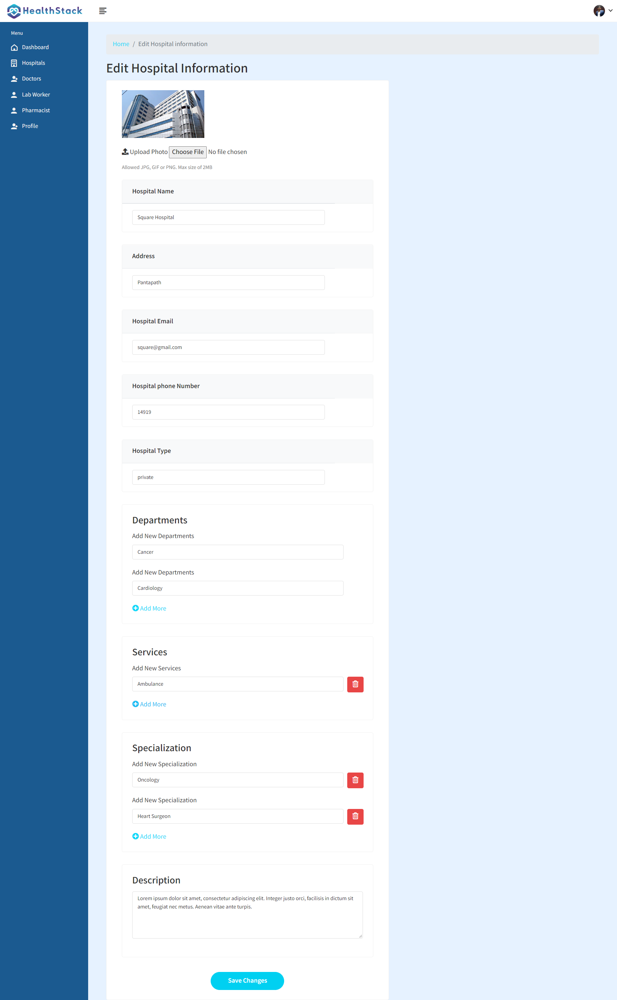

# Welcome To Hospital Admin

Hospital Admin is a cruical User for our project.

## Hospital Admin Task

- Accept / Reject Doctor
- Add and View Labworker
- Add and View Pharmacist
- Add,Edit and View Hospital
- Update Hospital Information


# Accept/Reject doctor
```python
def accept_doctor(request,pk):
    doctor = Doctor_Information.objects.get(doctor_id=pk)
    doctor.register_status = 'Accepted'
    doctor.save()
    
    experience= Experience.objects.filter(doctor_id=pk)
    education = Education.objects.filter(doctor_id=pk)
    
    # Mailtrap
    doctor_name = doctor.name
    doctor_email = doctor.email
    doctor_department = doctor.department_name.hospital_department_name

    doctor_specialization = doctor.specialization.specialization_name

    subject = "Acceptance of Doctor Registration"

    values = {
            "doctor_name":doctor_name,
            "doctor_email":doctor_email,
            "doctor_department":doctor_department,

            "doctor_specialization":doctor_specialization,
        }

    html_message = render_to_string('hospital_admin/accept-doctor-mail.html', {'values': values})
    plain_message = strip_tags(html_message)

    try:
        send_mail(subject, plain_message, 'hospital_admin@gmail.com',  [doctor_email], html_message=html_message, fail_silently=False)
    except BadHeaderError:
        return HttpResponse('Invalid header found')

    messages.success(request, 'Doctor Accepted!')
    return redirect('register-doctor-list')

def reject_doctor(request,pk):
    doctor = Doctor_Information.objects.get(doctor_id=pk)
    doctor.register_status = 'Rejected'
    doctor.save()
    
    # Mailtrap
    doctor_name = doctor.name
    doctor_email = doctor.email
    doctor_department = doctor.department_name.hospital_department_name
    doctor_hospital = doctor.hospital_name.name
    doctor_specialization = doctor.specialization.specialization_name

    subject = "Rejection of Doctor Registration"

    values = {
            "doctor_name":doctor_name,
            "doctor_email":doctor_email,
            "doctor_department":doctor_department,
            "doctor_hospital":doctor_hospital,
            "doctor_specialization":doctor_specialization,
        }

    html_message = render_to_string('hospital_admin/reject-doctor-mail.html', {'values': values})
    plain_message = strip_tags(html_message)

    try:
        send_mail(subject, plain_message, 'hospital_admin@gmail.com',  [doctor_email], html_message=html_message, fail_silently=False)
    except BadHeaderError:
        return HttpResponse('Invalid header found')
    
    messages.success(request, 'Doctor Rejected!')
    return redirect('register-doctor-list')
```


# Add and View Labworker
```python
def add_lab_worker(request):
    if request.user.is_hospital_admin:
        user = Admin_Information.objects.get(user=request.user)
        
        form = LabWorkerCreationForm()
     
        if request.method == 'POST':
            form = LabWorkerCreationForm(request.POST)
            if form.is_valid():
                # form.save(), commit=False --> don't save to database yet (we have a chance to modify object)
                user = form.save(commit=False)
                user.is_labworker = True
                user.save()

                messages.success(request, 'Clinical Laboratory Technician account was created!')

                # After user is created, we can log them in
                #login(request, user)
                return redirect('lab-worker-list')
            else:
                messages.error(request, 'An error has occurred during registration')
    
    context = {'form': form, 'admin': user}
    return render(request, 'hospital_admin/add-lab-worker.html', context)
```



# Add and View Pharmacist

```python
def add_pharmacist(request):
    if request.user.is_hospital_admin:
        user = Admin_Information.objects.get(user=request.user)
        form = PharmacistCreationForm()
     
        if request.method == 'POST':
            form = PharmacistCreationForm(request.POST)
            if form.is_valid():
                # form.save(), commit=False --> don't save to database yet (we have a chance to modify object)
                user = form.save(commit=False)
                user.is_pharmacist = True
                user.save()

                messages.success(request, 'Pharmacist account was created!')

                # After user is created, we can log them in
                #login(request, user)
                return redirect('pharmacist-list')
        else:
            messages.error(request, 'An error has occurred during registration')
    
    context = {'form': form, 'admin': user}
    return render(request, 'hospital_admin/add-pharmacist.html', context)
```



# Add,Edit and View Hospital
```python
def add_hospital(request):
    if  request.user.is_hospital_admin:
        user = Admin_Information.objects.get(user=request.user)

        if request.method == 'POST':
            hospital = Hospital_Information()
            
            if 'featured_image' in request.FILES:
                featured_image = request.FILES['featured_image']
            else:
                featured_image = "departments/default.png"
            
            hospital_name = request.POST.get('hospital_name')
            address = request.POST.get('address')
            description = request.POST.get('description')
            email = request.POST.get('email')
            phone_number = request.POST.get('phone_number') 
            hospital_type = request.POST.get('type')
            specialization_name = request.POST.getlist('specialization')
            department_name = request.POST.getlist('department')
            service_name = request.POST.getlist('service')
            
        
            hospital.name = hospital_name
            hospital.description = description
            hospital.address = address
            hospital.email = email
            hospital.phone_number =phone_number
            hospital.featured_image=featured_image 
            hospital.hospital_type=hospital_type
            
            # print(department_name[0])
         
            hospital.save()
            
            for i in range(len(department_name)):
                departments = hospital_department(hospital=hospital)
                # print(department_name[i])
                departments.hospital_department_name = department_name[i]
                departments.save()
                
            for i in range(len(specialization_name)):
                specializations = specialization(hospital=hospital)
                specializations.specialization_name=specialization_name[i]
                specializations.save()
                
            for i in range(len(service_name)):
                services = service(hospital=hospital)
                services.service_name = service_name[i]
                services.save()
            
            messages.success(request, 'Hospital Added')
            return redirect('hospital-list')

        context = { 'admin': user}
        return render(request, 'hospital_admin/add-hospital.html',context)
```


# Edit Hospital Information
```python
def edit_hospital(request, pk):
    if  request.user.is_hospital_admin:
        user = Admin_Information.objects.get(user=request.user)
        hospital = Hospital_Information.objects.get(hospital_id=pk)
        old_featured_image = hospital.featured_image

        if request.method == 'GET':
            specializations = specialization.objects.filter(hospital=hospital)
            services = service.objects.filter(hospital=hospital)
            departments = hospital_department.objects.filter(hospital=hospital)
            context = {'hospital': hospital, 'specializations': specializations, 'services': services,'departments':departments, 'admin': user}
            return render(request, 'hospital_admin/edit-hospital.html',context)

        elif request.method == 'POST':
            if 'featured_image' in request.FILES:
                featured_image = request.FILES['featured_image']
            else:
                featured_image = old_featured_image
                               
            hospital_name = request.POST.get('hospital_name')
            address = request.POST.get('address')
            description = request.POST.get('description')
            email = request.POST.get('email')
            phone_number = request.POST.get('phone_number') 
            hospital_type = request.POST.get('type')
            
            specialization_name = request.POST.getlist('specialization')
            department_name = request.POST.getlist('department')
            service_name = request.POST.getlist('service')

            hospital.name = hospital_name
            hospital.description = description
            hospital.address = address
            hospital.email = email
            hospital.phone_number =phone_number
            hospital.featured_image =featured_image 
            hospital.hospital_type =hospital_type
            
            # specializations.specialization_name=specialization_name
            # services.service_name = service_name
            # departments.hospital_department_name = department_name 

            hospital.save()

            # Specialization
            for i in range(len(specialization_name)):
                specializations = specialization(hospital=hospital)
                specializations.specialization_name = specialization_name[i]
                specializations.save()

            # Experience
            for i in range(len(service_name)):
                services = service(hospital=hospital)
                services.service_name = service_name[i]
                services.save()
                
            for i in range(len(department_name)):
                departments = hospital_department(hospital=hospital)
                departments.hospital_department_name = department_name[i]
                departments.save()

            messages.success(request, 'Hospital Updated')
            return redirect('hospital-list')

```


